# 🎯 Matchmaking

Block Racing의 매칭 시스템은 **자동 매칭**과 **Private Room**을 지원합니다.

매칭이 완료되면 `Room`을 생성하고 두 Player를 연결하며, 이후 Ready → Starting → Playing → Result 상태를 거쳐 게임의 전체 생명주기를 관리합니다.

---

## 🔄 전체 흐름

```mermaid
sequenceDiagram
    participant A as Client A
    participant S as Game Server
    participant B as Client B

    Note over A,B: Room 생성 또는 자동 매칭

    alt 자동 매칭
        A->>S: C_MatchRequestPacket
        B->>S: C_MatchRequestPacket

        S->>S: MatchMaker에서 Player 매칭
        S->>S: Room 생성
        S->>S: Player A, B 추가

    else 비공개 Room 생성
        A->>S: C_CreateRoomPacket
        S->>S: Room 생성
        S->>S: Player A 추가

        Note over S: RoomState = Waiting

        S-->>A: S_RoomCreatedPacket

        alt 방 생성 취소
            A->>S: C_CloseRoomPacket
            S->>S: Player 제거
            S->>S: RoomState = Closing
            S->>S: Room 삭제

        else 다른 Player 입장
            B->>S: C_JoinRoomPacket
            S->>S: Player B 추가
            S-->>B: S_RoomJoinedPacket
        end
    end

    Note over S: 두 Player 입장<br/>RoomState = Ready

    S-->>A: S_RoomReadyPacket
    S-->>B: S_RoomReadyPacket

    A->>A: Game Scene 로드
    B->>B: Game Scene 로드

    A->>S: C_ReadyPacket
    B->>S: C_ReadyPacket

    S->>S: Ready 상태 확인

    Note over S: 두 Player 모두 Ready<br/>RoomState = Starting

    S->>S: GameSimulation.Initialize()

    S-->>A: S_StartGamePacket
    S-->>B: S_StartGamePacket

    Note over S: Countdown 완료<br/>RoomState = Playing

    loop Game Play
        A->>S: C_InputPacket
        B->>S: C_InputPacket

        S->>S: GameSimulation.Update()

        S-->>A: S_GameStatePacket
        S-->>B: S_GameStatePacket
    end

    Note over S: 게임 종료

    S-->>A: S_GameEndPacket
    S-->>B: S_GameEndPacket

    Note over S: RoomState = Result

    alt 두 Player 모두 재대결 신청
        A->>S: C_RematchRequestPacket
        B->>S: C_RematchRequestPacket

        S->>S: 재대결 요청 확인
        S->>S: Ready 상태 초기화

        Note over S: RoomState = Ready

        S-->>A: S_RoomReadyPacket
        S-->>B: S_RoomReadyPacket

        Note over A,B: 다시 Game Scene 로드

    else 한 Player가 나가기
        A->>S: C_ExitRoomPacket

        S->>S: Player 제거
        S->>S: RoomState = Closing

        S-->>B: S_OpponentExitPacket

        S->>S: Room 삭제
    end
```

---

# 🏠 Room Lifecycle

Room은 게임의 진행 상태를 `RoomState`로 관리합니다.

```csharp
public enum RoomState
{
    Waiting,
    Ready,
    Starting,
    Playing,
    Result,
    Closing
}
```

| 상태         | 설명                                        |
| ---------- | ----------------------------------------- |
| `Waiting`  | 두 번째 Player의 입장을 기다리는 상태                  |
| `Ready`    | 두 Player가 입장하여 게임 Scene 준비를 기다리는 상태       |
| `Starting` | 두 Player의 준비가 완료되어 게임 시작 및 카운트다운을 진행하는 상태 |
| `Playing`  | 게임이 진행 중인 상태                              |
| `Result`   | 게임 종료 후 재대결 또는 Room 나가기를 기다리는 상태          |
| `Closing`  | Room 사용이 종료되어 삭제를 기다리는 상태                 |

### Room 상태 흐름

```text
Waiting
   │
   │ Player 2 입장
   ▼
Ready
   │
   │ 두 Player Ready
   ▼
Starting
   │
   │ Countdown 완료
   ▼
Playing
   │
   │ Game End
   ▼
Result
   │
   ├── Rematch → Ready
   │
   └── Exit → Closing
                  │
                  ▼
               Removed
```

`Result` 상태를 별도로 둔 이유는 **게임 종료와 Room 종료를 분리하기 위해서**입니다.

초기에는 게임이 종료되면 Room을 즉시 삭제했지만, 재대결 기능을 구현하면서 게임 종료 이후에도 기존 Room과 Player 관계를 유지할 필요가 생겼습니다.

따라서 게임이 종료되면 Room은 `Result` 상태로 유지되고, 두 Player가 재대결을 선택하면 동일한 Room을 재사용합니다.

---

# 🔀 Matchmaking Architecture

매칭 시스템은 다음 세 객체의 책임을 분리하여 구성했습니다.

```text
GameManager
    │
    ├── MatchMaker
    │      └── 자동 매칭 상태 / 매칭 처리
    │
    └── RoomManager
           └── Room 생성 / 삭제 / 조회
                    │
                    ▼
                   Room
                    │
                    └── Player 관리 / 게임 상태 관리
```

### MatchMaker

자동 매칭을 담당합니다.

* 매칭 요청 Player 관리
* 매칭 후보 탐색
* Player 예약
* Room 생성 요청
* 매칭 실패 시 상태 복구

### RoomManager

Room의 생명주기를 관리합니다.

* Room 생성
* Room 삭제
* Room 조회
* Private RoomCode 관리

### Room

실제 게임에 참여하는 Player와 게임 상태를 관리합니다.

* Player 추가 / 제거
* RoomState 관리
* Ready 상태 관리
* 게임 시작 / 종료
* Rematch 상태 관리

---

# 🤖 Automatic Matchmaking

자동 매칭은 게임 시작을 요청한 Player 중 두 명을 찾아 하나의 Room으로 연결하는 방식입니다.

Player의 현재 매칭 상태는 `MatchState`로 관리합니다.

```csharp
public enum MatchState
{
    None,
    Queued,
    Matching,
    InRoom
}
```

| 상태         | 설명                           | 주요 전환                   |
| ---------- | ---------------------------- | ----------------------- |
| `None`     | 매칭이나 Room에 속하지 않은 상태         | 로그인 후 / 매칭 취소 / Room 종료 |
| `Queued`   | 자동 매칭을 신청하고 대기 중인 상태         | `None → Queued`         |
| `Matching` | 매칭 후보로 선택되어 Room에 추가하는 중인 상태 | `Queued → Matching`     |
| `InRoom`   | Room에 정상적으로 소속된 상태           | Room 생성 / 입장 후          |

---

## MatchMaker 동작

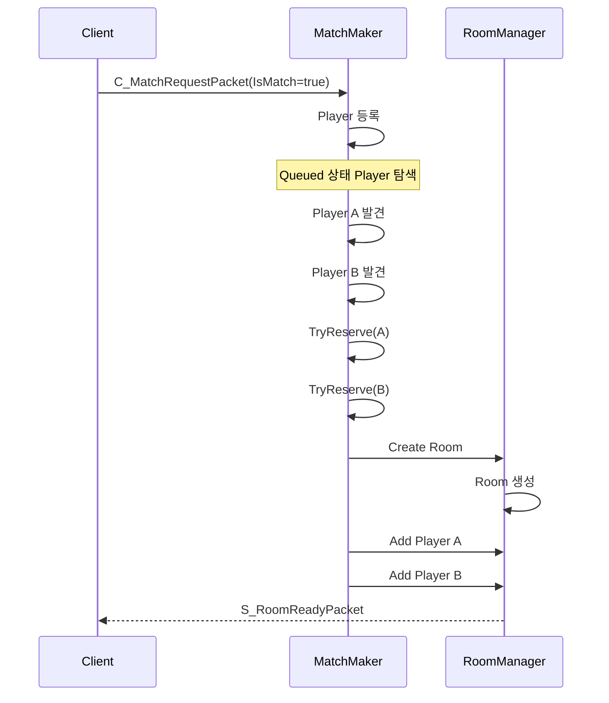

클라이언트가 `C_MatchRequestPacket`을 전송하면 `IsMatch` 값에 따라 동작합니다.

```text
IsMatch == true
    → MatchMaker에 등록
    → MatchState = Queued

IsMatch == false
    → 매칭 취소
    → MatchMaker에서 제거
    → MatchState = None
```

MatchMaker는 두 명의 `Queued` Player를 발견하면 Room을 생성하고 두 Player를 추가합니다.

두 Player가 정상적으로 Room에 추가되면 Room은 `Ready` 상태로 전환되고 두 클라이언트에 `S_RoomReadyPacket`을 전송합니다.

---

## Match Processing

매칭은 `GameManager`의 Tick에서 주기적으로 실행됩니다.

```text
Game Tick
    │
    ▼
MatchMaker.Update()
    │
    ▼
TryMatch()
    │
    ├── Candidate Search
    ├── Player Reservation
    ├── Room Creation
    └── Player Add
```

한 Tick에서 최대 `10회`까지 매칭을 시도하도록 제한하여 한 번의 Update에서 과도한 매칭 작업이 발생하지 않도록 구성했습니다.

---

# 🔒 Concurrent Match Prevention

자동 매칭에서는 동일한 Player가 동시에 여러 매칭 후보로 선택되는 상황을 방지해야 합니다.

예를 들어 여러 매칭 작업이 동시에 실행되면 다음과 같은 문제가 발생할 수 있습니다.

```text
Task 1 → Player A 선택
Task 2 → Player A 선택

Task 1 → Room 1 생성
Task 2 → Room 2 생성
```

이를 방지하기 위해 Room을 생성하기 전에 Player 상태를 `Queued`에서 `Matching`으로 변경하여 먼저 예약합니다.

```csharp
private bool TryReserve(Player player)
{
    if (player.MatchState != MatchState.Queued)
        return false;

    player.MatchState = MatchState.Matching;

    return true;
}
```

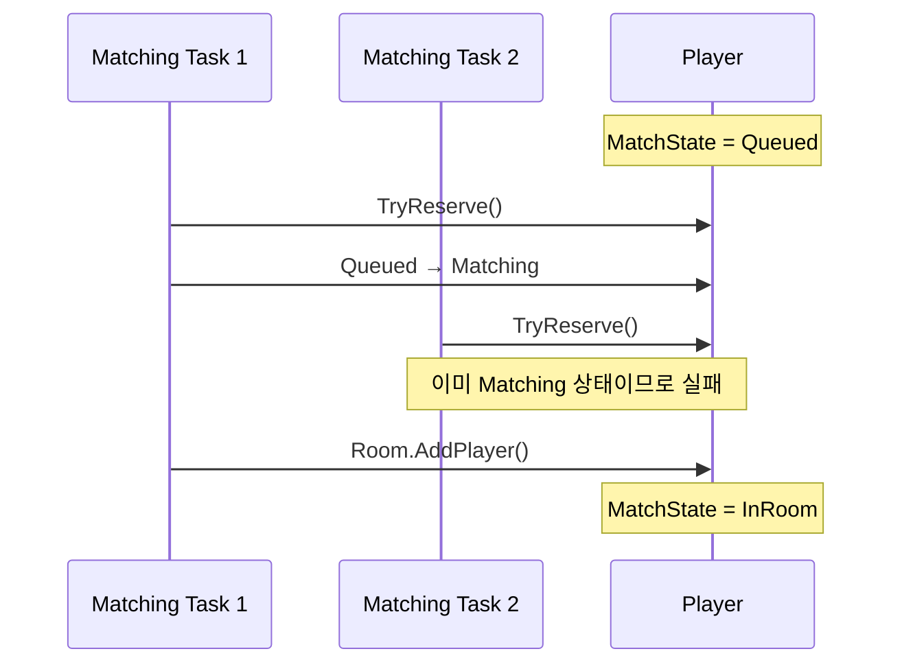

`Matching`은 매칭 후보로 선택되었지만 아직 Room에 정상적으로 추가되지 않은 **예약 상태**입니다.

두 번째 Player 예약에 실패하면 먼저 예약한 Player를 다시 `Queued`로 복구합니다.

```text
Player A: Queued → Matching
Player B: Queued → Matching 실패

Player A: Matching → Queued
```

Room 생성 또는 Player 추가 과정에서 문제가 발생한 경우에도 관련 Player의 상태를 정리하여 다시 매칭 가능한 상태로 복구합니다.

---

# 🔐 Private Room

Private Room은 RoomCode를 이용하여 특정 Player와 함께 게임을 시작할 수 있는 기능입니다.

```text
Create Room
    │
    ├── RoomId 생성
    ├── RoomCode 생성
    └── Player A 추가
             │
             ▼
       RoomState = Waiting
```

---

## Room Creation

Player가 `C_CreateRoomPacket`을 전송하면 `RoomManager`가 Room을 생성합니다.

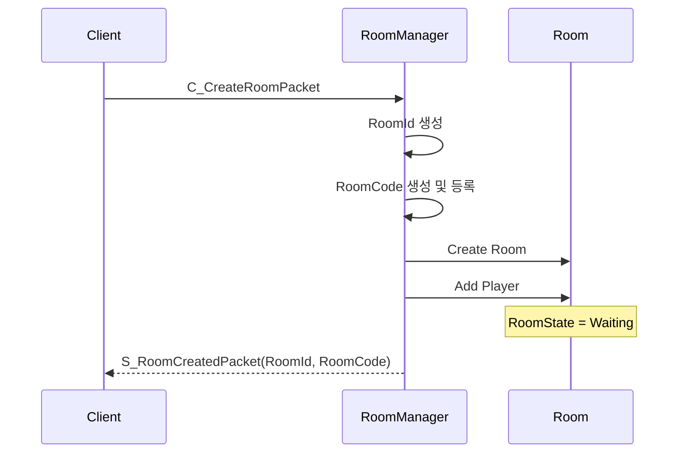

Private Room에는 Player가 다른 사용자에게 공유할 수 있는 `RoomCode`가 생성됩니다.

RoomCode는 `RoomId`와 별도로 관리하며, `RoomManager`에서 중복 등록을 방지합니다.

```csharp
private readonly ConcurrentDictionary<string, int> _roomCodes = new();

public string RegisterRoomCode(Room room)
{
    while (true)
    {
        string roomCode = GenerateRoomCode();

        if (_roomCodes.TryAdd(roomCode, room.Id))
            return roomCode;
    }
}
```

RoomCode는 6자리 문자열로 생성하며, 이미 등록된 코드가 생성된 경우 다시 생성합니다.

---

## Room Join

다른 Player는 Room 생성자로부터 전달받은 `RoomCode`를 사용하여 입장을 요청합니다.

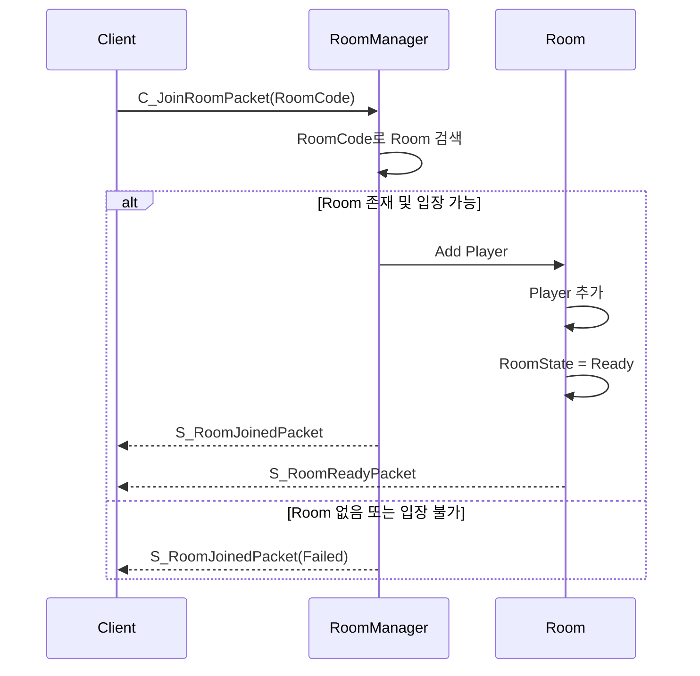

Room 입장 결과는 `RoomJoinResult`로 관리합니다.

```csharp
public enum RoomJoinResult : byte
{
    Success,

    AlreadyQueued,
    AlreadyInRoom,

    RoomNotFound,
    RoomFull,
    UnknownError
}
```

| 결과              | 설명                            |
| --------------- | ----------------------------- |
| `Success`       | Room을 찾았고 정상적으로 입장한 상태        |
| `AlreadyQueued` | 자동 매칭 대기열에 등록되어 있는 상태         |
| `AlreadyInRoom` | 이미 다른 Room에 소속된 상태            |
| `RoomNotFound`  | 해당 RoomCode의 Room이 존재하지 않는 상태 |
| `RoomFull`      | Room에 이미 최대 인원 2명이 존재하는 상태    |
| `UnknownError`  | 정의되지 않은 오류가 발생한 상태            |

`RoomJoinResult`는 Common 프로젝트에서 관리하여 서버와 클라이언트가 동일한 결과 값을 사용합니다.

서버는 `S_RoomJoinedPacket`에 처리 결과를 포함하여 전달하고, 클라이언트는 해당 결과를 기준으로 성공 여부 또는 실패 원인을 표시합니다.

---

# 🚪 Private Room Cancel

Room 생성자는 다른 Player가 입장하기 전에 Room을 닫을 수 있습니다.

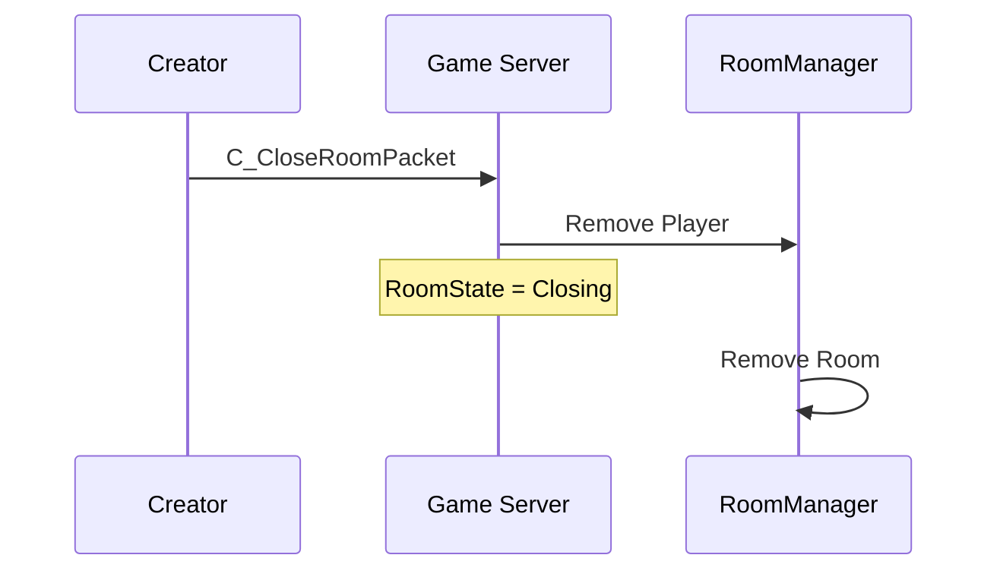

`C_CloseRoomPacket`을 수신하면 Room에서 Player를 제거하고 Room을 `Closing` 상태로 변경합니다.

이후 `RoomManager`를 통해 Room과 RoomCode를 제거합니다.

---

# ⚔️ Room Cancel / Join Race Condition

Private Room에서는 Room 생성자의 취소 요청과 다른 Player의 입장 요청이 거의 동시에 발생할 수 있습니다.

```text
Player A: Room 생성
Player B: Room 입장 요청
Player A: Room 생성 취소
```

이 경우 단순히 `RoomManager`에서 Room이 존재하는지만 확인해서는 충분하지 않습니다.

따라서 최종 입장 가능 여부는 `Room.AddPlayer()` 내부에서도 다시 검증합니다.

```csharp
public async Task<bool> AddPlayer(Player player)
{
    if (State != RoomState.Waiting)
        return false;

    if (_players.Count >= 2)
        return false;

    if (player.Room != null)
        return false;

    // Add Player
}
```

즉, `RoomManager`에서 Room을 찾았더라도 실제 Player 추가 시점에 Room 상태와 인원 수를 다시 확인합니다.

### Cancel이 먼저 처리되는 경우

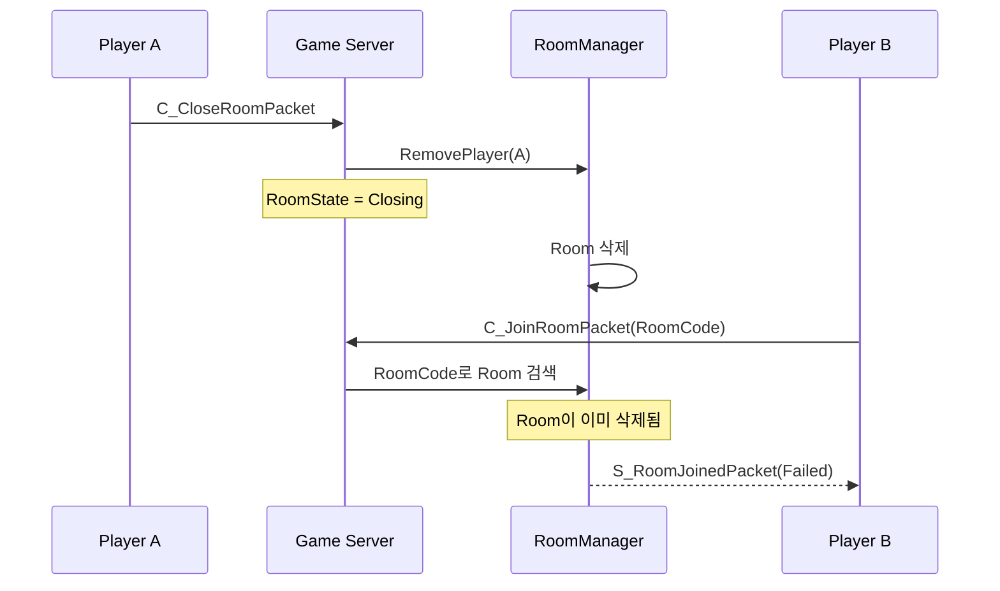

Room 취소가 먼저 처리되면 Room이 삭제되므로 이후 입장 요청은 `RoomNotFound`로 처리됩니다.

### Join이 먼저 처리되는 경우

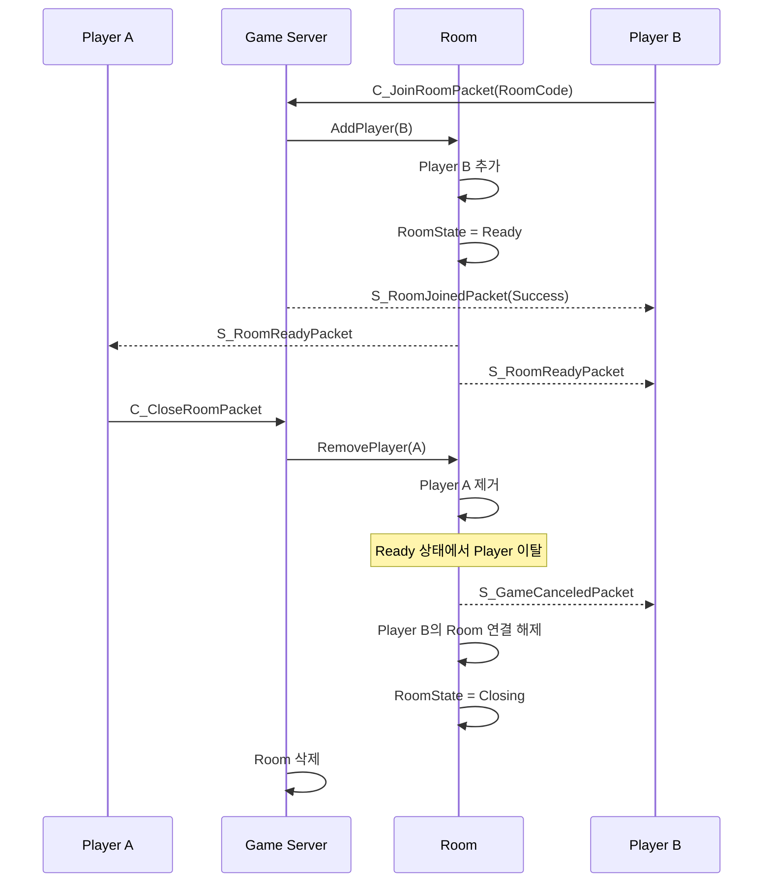

입장 요청이 먼저 처리되면 두 Player가 Room에 들어간 이후 생성자가 이탈하는 상황이 발생할 수 있습니다.

이 경우 서버는 남아있는 Player에게 `S_GameCanceledPacket`을 전달하고 Room을 `Closing` 상태로 전환한 뒤 삭제합니다.

따라서 요청 처리 순서에 따라 결과는 달라질 수 있지만, Room 내부 상태와 `AddPlayer()`의 재검증을 통해 **한 명만 남은 상태에서 게임이 시작되는 비정상적인 상태를 방지**합니다.

---

# 🔁 Rematch

게임이 종료된 후에도 동일한 두 Player가 다시 게임할 수 있도록 Rematch를 지원합니다.

게임 종료 시 Room을 즉시 삭제하지 않고 `Result` 상태로 유지합니다.

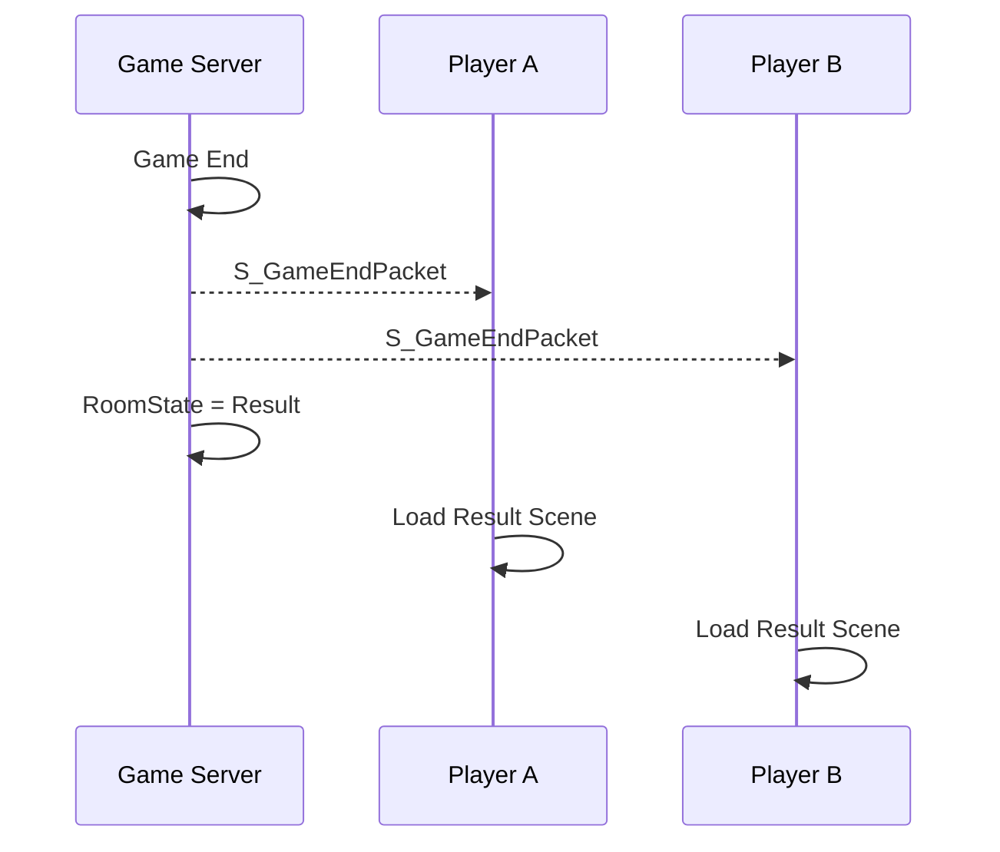

초기 구현에서는 게임 종료 시 Room을 즉시 삭제했지만, Rematch 기능을 추가하면서 **게임의 종료와 Room의 종료를 분리**했습니다.

---

## Rematch Request

각 Player의 재대결 요청 여부는 `_rematchMap`으로 관리합니다.

```csharp
private readonly Dictionary<int, bool> _rematchMap = new();
```

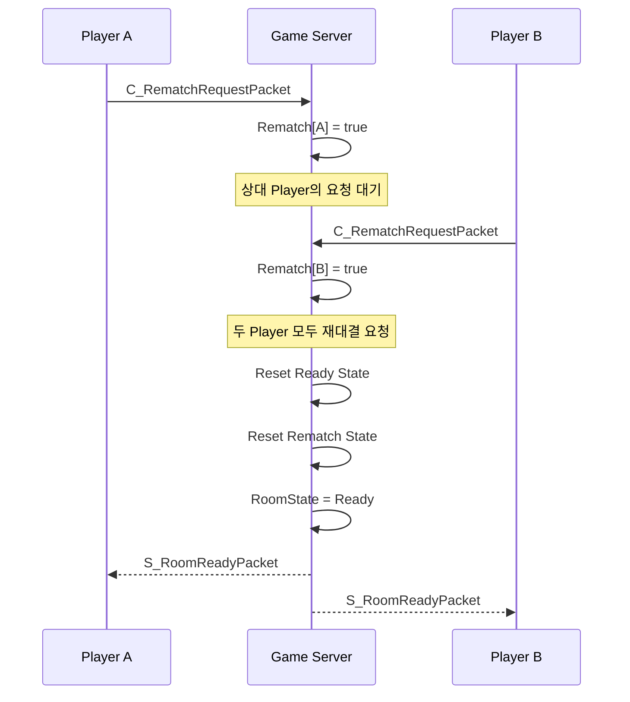

한 Player만 재대결을 요청한 경우에는 Room 상태를 변경하지 않고 상대 Player의 요청을 기다립니다.

두 Player 모두 요청한 경우:

1. Ready 상태 초기화
2. Rematch 상태 초기화
3. RoomState를 `Ready`로 변경
4. `S_RoomReadyPacket` 전송
5. Game Scene 로드
6. `C_ReadyPacket` 수신
7. 기존 게임 시작 과정 재진행

기존 Room과 Player 관계를 그대로 유지하기 때문에 새로운 Room을 생성할 필요가 없습니다.

---

# 🚪 Result State Exit

Result 상태에서 한 Player가 로비로 나가면 해당 Room에서는 더 이상 Rematch를 진행할 수 없습니다.

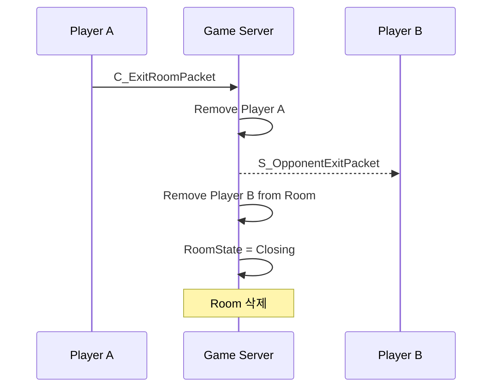

남아있는 Player에게 `S_OpponentExitPacket`을 전달하여 상대가 Room을 나갔음을 알립니다.

클라이언트는 해당 패킷을 수신하면 Rematch 기능을 비활성화하고 로비로 돌아갈 수 있도록 처리합니다.

---

# 🧩 Matchmaking Design Summary

Block Racing의 매칭 시스템은 **Player 상태와 Room 상태를 분리하여 관리**합니다.

```text
Player
  │
  └── MatchState
       ├── None
       ├── Queued
       ├── Matching
       └── InRoom

Room
  │
  └── RoomState
       ├── Waiting
       ├── Ready
       ├── Starting
       ├── Playing
       ├── Result
       └── Closing
```

이를 통해 다음과 같은 책임을 분리했습니다.

* `MatchMaker` → 자동 매칭 및 Player 예약
* `RoomManager` → Room 생성 / 삭제 / 조회 및 RoomCode 관리
* `Room` → Player 관계와 게임 상태 관리
* `Player.MatchState` → 매칭 과정에서 Player의 상태 관리
* `Room.RoomState` → Room의 전체 생명주기 관리

특히 `Queued → Matching → InRoom` 상태와 `Waiting → Ready → Starting → Playing → Result → Closing` 상태를 분리하여 **매칭 중인 Player의 상태와 실제 게임 Room의 상태를 독립적으로 관리**하도록 구성했습니다.
