# 🌐 Network

Block Racing의 네트워크는 **TCP Socket 기반의 Client-Server 구조**로 구성되어 있습니다.

클라이언트는 게임 입력과 요청을 패킷으로 전송하고, 서버는 이를 처리한 뒤 게임 상태와 이벤트를 패킷으로 응답합니다.

---

## 🔄 Network Flow

```mermaid
sequenceDiagram
    participant C as Unity Client
    participant S as Game Server

    %% TCP Connection
    C->>S: TCP Connect
    S-->>C: Connection Accepted

    %% Login
    C->>S: C_LoginPacket(Nickname)
    S->>S: Create Player
    S-->>C: S_LoginPacket(PlayerId)

    %% Match Making
    C->>S: C_MatchRequestPacket(IsMatch=true)
    S->>S: MatchMaker.Enqueue()
    S-->>S: Waiting Queue

    C->>S: C_MatchRequestPacket(IsMatch=false)
    S->>S: MatchMaker.Cancel()

    %% Match / Private Room
    S->>S: Match Success
    S->>S: Create Room
    S->>S: Add Players
    S-->>C: S_RoomReadyPacket(RoomId)

    C->>S: C_CreateRoomPacket
    S->>S: Create Room
    S->>S: Add Player
    S-->>C: S_RoomCreatedPacket(RoomId, RoomCode)

    C->>S: C_JoinRoomPacket(RoomCode)
    S->>S: Find Room
    S->>S: Add Player
    S-->>C: S_RoomJoinedPacket(RoomId)
    S-->>C: S_RoomReadyPacket(RoomId)

    %% Ready / Start
    C->>S: C_ReadyPacket
    S->>S: Ready Check

    S->>S: Both Players Ready
    S->>S: GameSimulation.Initialize()
    S-->>C: S_StartGamePacket(RoomId, StartTick)

    %% Game Cancel
    C-->>S: Disconnect
    S->>S: Remove Player
    S-->>C: S_GameCanceledPacket

    %% Game Play
    loop Server Tick
        C->>S: C_InputPacket(Player Input)
        S->>S: Input Queue
        S->>S: GameSimulation.Update()
        S->>S: Collision / Block / Rule Logic
        S-->>C: S_GameStatePacket(GameStateSnapshot)
    end

    %% Game End
    S->>S: Check Game End
    S-->>C: S_GameEndPacket(Result)

    %% Rematch
    C->>S: C_RematchRequestPacket
    S->>S: Record Rematch Request

    S->>S: Both Players Requested
    S->>S: Reset Room State
    S-->>C: S_RoomReadyPacket(RoomId)

    C->>S: C_ReadyPacket
    S->>S: GameSimulation.Initialize()
    S-->>C: S_StartGamePacket(RoomId, StartTick)

    %% Exit
    C->>S: C_ExitRoomPacket
    S->>S: Remove Player
    S-->>C: S_OpponentExitPacket
    S->>S: Close Room
    S->>S: Remove Room

    %% Heartbeat
    loop Heartbeat
        S-->>C: S_HeartbeatPacket
        C-->>S: C_HeartbeatPacket
    end
```



---

### Connection

클라이언트가 서버에 TCP 연결을 생성하면 서버는 연결을 수락하고 `PlayerSession`을 생성합니다.

`PlayerSession`은 하나의 TCP 연결을 관리하며 수신 데이터 처리와 패킷 전송을 담당합니다.

```text
Unity Client
    │
    │ TCP Connect
    ▼
TcpServer
    │
    ▼
PlayerSession
```

---

### Login

로그인 요청을 통해 현재 연결된 Session에 Player를 등록합니다.

```text
C_LoginPacket
    │
    ▼
Create Player
    │
    ▼
S_LoginPacket(PlayerId)
```

`SessionId`는 TCP 연결 단위로 관리되고, `PlayerId`는 로그인한 플레이어에게 부여됩니다.

---

### 🚪 Exit / Disconnect

플레이어가 방을 나가는 경우 서버는 해당 플레이어를 Room에서 제거하고 상대 플레이어에게 퇴장 사실을 전달합니다.

```text
C_ExitRoomPacket
        │
        ▼
Remove Player
        │
        ▼
S_OpponentExitPacket
        │
        ▼
Close Room
        │
        ▼
Remove Room
```

게임 진행 중 연결이 끊어진 경우에도 서버는 Session과 Player 상태를 정리하고 필요한 경우 상대 플레이어에게 게임 취소를 전달합니다.

---

### ❤️ Heartbeat

TCP 연결이 유지되고 있는지 확인하기 위해 서버와 클라이언트는 Heartbeat 패킷을 주고받습니다.

```text
Game Server
    │
    │ S_HeartbeatPacket
    ▼
Unity Client
    │
    │ C_HeartbeatPacket
    ▼
Game Server
```

Heartbeat는 게임 데이터와 별도로 연결 상태를 확인하기 위한 용도로 사용됩니다.

---

# 📦 Packet List

| Category       | Packet                   | Direction | Description              |
| -------------- | ------------------------ | --------- | ------------------------ |
| **Login**      | `C_LoginPacket`          | C → S     | 플레이어 로그인 요청              |
|                | `S_LoginPacket`          | S → C     | PlayerId 전달              |
| **Match**      | `C_MatchRequestPacket`   | C → S     | 매칭 요청 / 취소               |
| **Room**       | `C_CreateRoomPacket`     | C → S     | Private Room 생성          |
|                | `S_RoomCreatedPacket`    | S → C     | Room 생성 결과 및 RoomCode 전달 |
|                | `C_JoinRoomPacket`       | C → S     | Room 입장 요청               |
|                | `S_RoomJoinedPacket`     | S → C     | Room 입장 결과               |
|                | `C_CloseRoomPacket`      | C → S     | Room 종료 요청               |
|                | `S_RoomReadyPacket`      | S → C     | Room 준비 완료 상태 전달         |
| **Game Start** | `C_ReadyPacket`          | C → S     | 게임 준비 요청                 |
|                | `S_StartGamePacket`      | S → C     | 게임 시작 정보 전달              |
|                | `S_GameCanceledPacket`   | S → C     | 게임 취소 알림                 |
| **Game Play**  | `C_InputPacket`          | C → S     | 플레이어 입력 전달               |
|                | `S_GameStatePacket`      | S → C     | 게임 상태 Snapshot 전달        |
| **Game End**   | `S_GameEndPacket`        | S → C     | 게임 결과 전달                 |
|                | `C_RematchRequestPacket` | C → S     | 재대전 요청                   |
|                | `C_ExitRoomPacket`       | C → S     | Room 퇴장 요청               |
|                | `S_OpponentExitPacket`   | S → C     | 상대 플레이어 퇴장 알림            |
| **Connection** | `S_HeartbeatPacket`      | S → C     | 연결 상태 확인                 |
|                | `C_HeartbeatPacket`      | C → S     | Heartbeat 응답             |

---

# 🧱 Packet Structure

모든 게임 패킷은 공통된 Header와 Body 구조를 사용합니다.

```text
┌──────────────┬──────────────┬──────────────────────┐
│ Length       │ PacketId     │ Body                 │
│ 2 Bytes      │ 2 Bytes      │ Variable             │
└──────────────┴──────────────┴──────────────────────┘
```

### Header

| Field      |     Size | Description |
| ---------- | -------: | ----------- |
| `Length`   |  2 Bytes | 전체 패킷 길이    |
| `PacketId` |  2 Bytes | 패킷 종류 식별자   |
| `Body`     | Variable | 패킷 데이터      |

`Length`와 `PacketId`는 `ushort`를 사용하여 작은 패킷이 대부분인 게임 특성상 Header 크기를 최소화했습니다.

---

# 🔗 TCP Message Framing

TCP는 메시지 단위가 아닌 **Byte Stream**을 전달하기 때문에 하나의 `Receive()`에서 하나의 패킷이 완전히 수신된다는 보장이 없습니다.

따라서 서버는 `ReceiveBuffer`를 사용하여 수신된 데이터를 누적하고 Header의 `Length`를 기준으로 완전한 패킷을 조립합니다.

```text
TCP Receive
     │
     ▼
ReceiveBuffer
     │
     ├── 데이터 누적
     │
     ├── Length 확인
     │
     ├── 패킷 완성 여부 확인
     │
     └── 완성된 Packet 추출
             │
             ▼
        PacketReader
```

이를 통해 다음과 같은 TCP 특성을 처리할 수 있습니다.

* 하나의 패킷이 여러 번에 나누어 수신되는 경우
* 여러 패킷이 한 번에 수신되는 경우
* 패킷 경계와 TCP `Receive()` 경계가 일치하지 않는 경우

---

# 🔄 Serialization

패킷 객체와 Byte 배열 사이의 변환은 `PacketWriter`와 `PacketReader`가 담당합니다.

### Serialize

```text
Packet Object
      │
      ▼
PacketWriter
      │
      ▼
byte[]
      │
      ▼
TCP Send
```

### Deserialize

```text
TCP Receive
      │
      ▼
byte[]
      │
      ▼
PacketReader
      │
      ▼
Packet Object
```

패킷별 `Read()` / `Write()` 구현을 통해 필요한 데이터만 직렬화하도록 구성했습니다.

---

# ⚙️ Packet Processing

수신된 패킷은 `PacketManager`를 통해 적절한 Packet과 Handler로 전달됩니다.

```text
TCP Receive
    │
    ▼
ReceiveBuffer
    │
    ▼
PacketReader
    │
    ▼
PacketManager
    │
    ├── PacketId 확인
    ├── Packet 생성
    └── Handler 조회
    │
    ▼
Packet Handler
    │
    ▼
Game Logic
```

`PacketId`와 Handler를 매핑하여 새로운 패킷이 추가되더라도 기존 네트워크 처리 구조를 변경하지 않고 확장할 수 있도록 구성했습니다.

---

# ⚡ Async Network Processing

네트워크 I/O는 `async/await` 기반으로 처리합니다.

```text
Client
  │
  ▼
Async Receive
  │
  ├── 다른 작업 수행 가능
  │
  ▼
Packet Received
  │
  ▼
Process Packet
```

Socket I/O 대기 동안 Thread를 불필요하게 점유하지 않도록 구성하여 다수의 연결을 처리할 수 있도록 했습니다.

---

## 📌 Network Design

Block Racing의 네트워크 구조는 다음과 같은 방향으로 설계했습니다.

* **TCP 기반**으로 데이터의 신뢰성과 순서를 보장
* `Length + PacketId + Body` 구조의 **Custom Binary Protocol** 사용
* `ReceiveBuffer`를 통한 **TCP Stream Framing**
* `PacketReader / PacketWriter`를 통한 **직렬화 추상화**
* `PacketManager + Handler` 구조를 통한 **패킷 처리 분리**
* `Heartbeat`를 통한 **연결 상태 관리**
